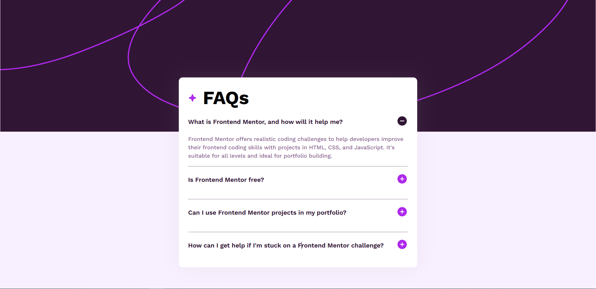
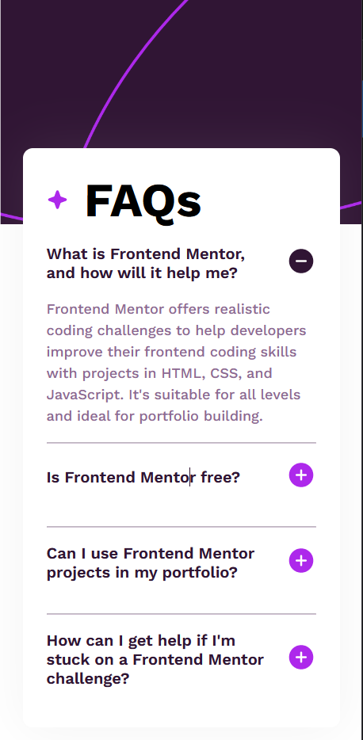

# Frontend Mentor - FAQ accordion solution

This is a solution to the [FAQ accordion challenge on Frontend Mentor](https://www.frontendmentor.io/challenges/faq-accordion-wyfFdeBwBz). Frontend Mentor challenges help you improve your coding skills by building realistic projects. 

## Table of contents

- [Overview](#overview)
  - [The challenge](#the-challenge)
  - [Screenshot](#screenshot)
  - [Links](#links)
  - [What I learned](#what-i-learned)
  - [Useful resources](#useful-resources)
- [Author](#author)

## Overview

### The challenge

Users should be able to:

- Hide/Show the answer to a question when the question is clicked
- View the optimal layout for the interface depending on their device's screen size
- See hover and focus states for all interactive elements on the page

### Screenshot

### Links

- Solution URL: [Github](https://github.com/AashishVivekBhat/FAQ_accordian)
- Live Site URL: [Live Demo](https://aashishvivekbhat.github.io/FAQ_accordian/)

### What I learned

- Implementation of basic Javascript concepts: Conditional statements, Arrow Functions, loops etc
- DOM Manipulation
- Event Listeners

### Useful resources

- [W3Schools](https://www.w3schools.com/howto/howto_js_accordion.asp) - This helped me for understanding different ways to implement JS concepts as per the requirements using simple and concise explanation.

## Author
- Frontend Mentor - [@AashishVivekBhat](https://www.frontendmentor.io/profile/AashishVivekBhat)